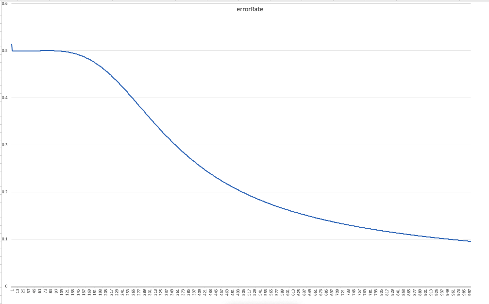
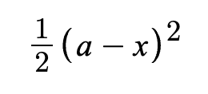
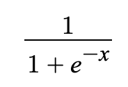
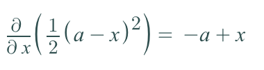
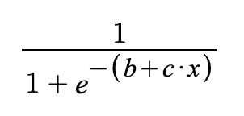
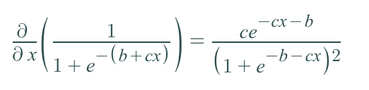
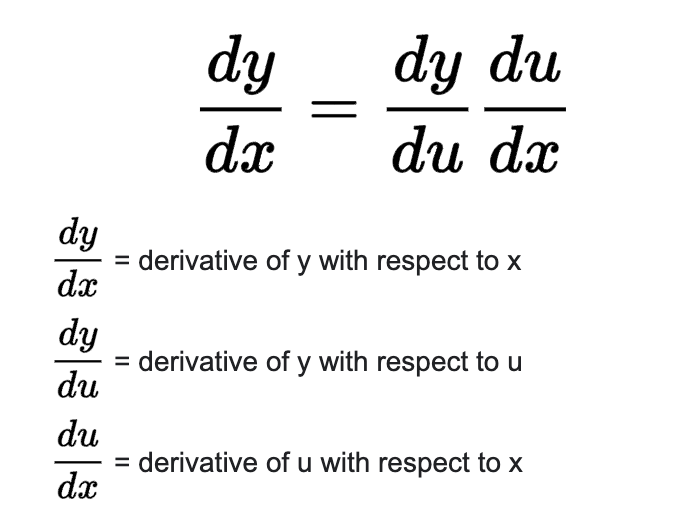

# Neural Network in C

## Basic XOR (ie, "Hello World" of neural networks)

```console
$ gcc basicXOR.c && ./a.out
```

## Training



Error Rate - Vertical/Y Axis

Epoch step - Horizontal/X Axis

## Theoretical Intuition

Error Rate Function



Sigmoid Activation function



Partial Derivative of error rate with respect to x



Sigmoid activation with weight (x) given sibling neuron outputs + bias (b) and direct input (c)



Partial Derivative of sigmoid activation with respect to weight (x) given sibling neuron outputs + bias (b) and direct input (c)



Chain Rule


